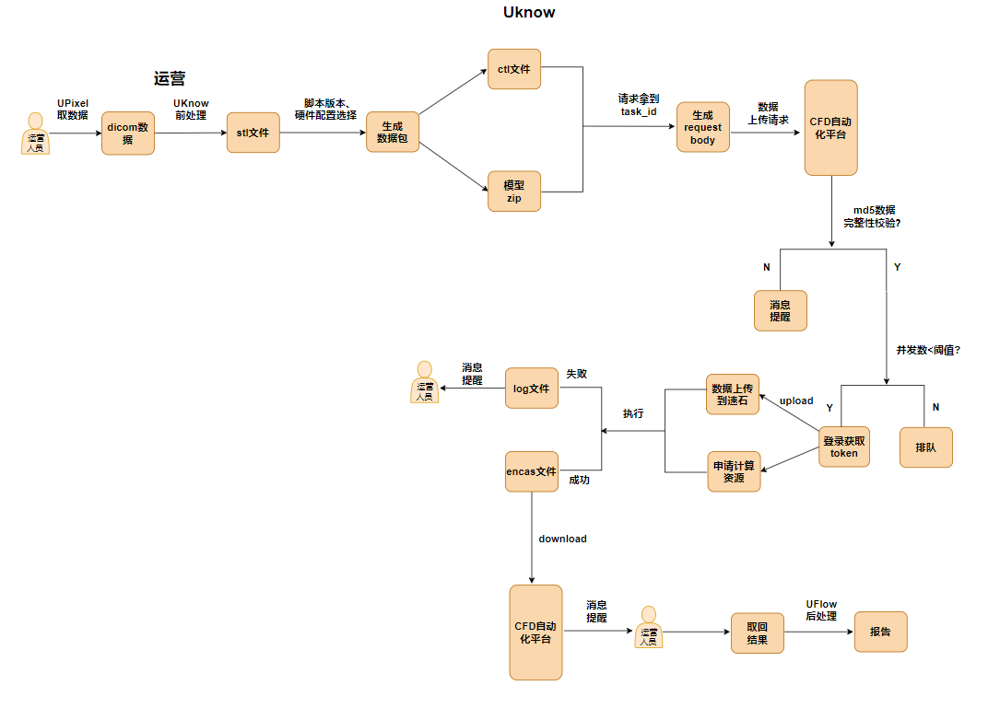

# CFD

## 1. 流程图

<div align=center>
    
</div>

## 2. aerich迁移

初始化
```bash
cd server
aerich init -t dbs.database.TORTOISE_ORM
aerich init-db
```

修改数据
```bash
cd server
aerich migrate --name drop_column
aerich upgrade
```


注意，要将所有的models写到一个文件里，当一个文件需要依赖另外一个文件作为外键的时候，不放在一个文件里无法迁移


## 3. 数据序列化

```python
from tortoise.contrib.pydantic import pydantic_queryset_creator  # noqa
from apps.models import Category, Article  # noqa

pqc = pydantic_queryset_creator(Category)
query_set = Category.filter(uuid__in=['924ca426-707e-11ed-a5c0-acde48001122'])
query_data = await pqc.from_queryset(query_set)
```

## 3. 启动项目

### 1. 启动fastapi

```bash
cd server
python main.py
```

### 2. 启动celery

Windows

```bash
cd server
celery -A worker.celery worker --pool=solo -l info
```
<https://stackoverflow.com/a/47331550/10844937>

注意: 这个地方只能用`--pool=solo`的形式启动, 这种方式并不是并行的, 目前采用`gevent`和`eventlet`都会有问题

Unix

```bash
cd server
celery -A worker.celery worker -l info
```

